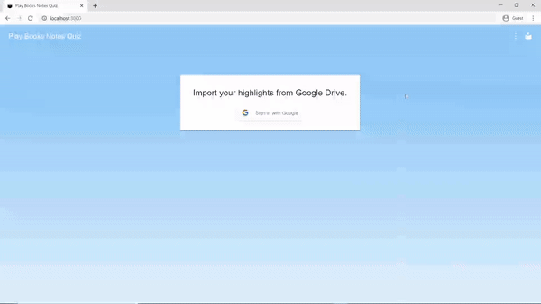
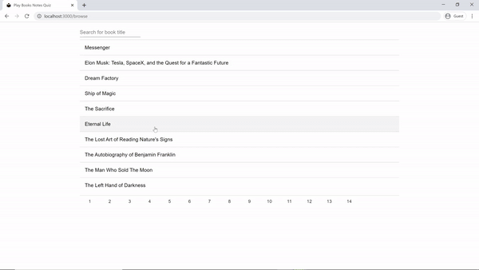
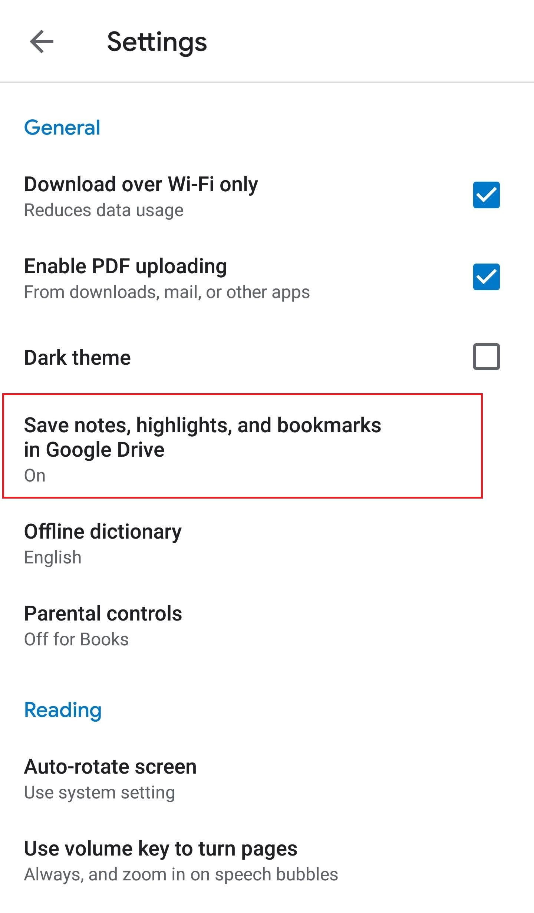
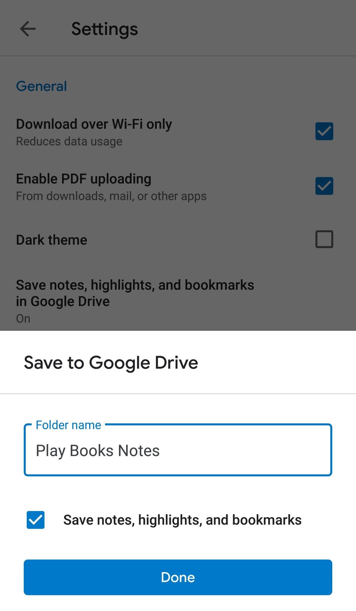

## Overview
**This ReactJS web app is a way to encourage a sentimental e-book lover to look back at their highlights and notes, in the format of a quiz.**

The quiz presents the user with a book quote that they highlighted, and challenges them to identify which book title it originates from.

Features
* Easy import of highlights and highlight notes from Google Play Books
* Displays any notes the user took for that highlight, the matching highlight color, and the date the highlight was made
* Each quote includes a link to the exact location of the quote in the e-book in Google Play Books
* Ability to "favorite" a quote to keep track of quotes you want to save and look back at later
* "Browse" mode that presents all highlights and notes in a clean UI, grouped by book title

## Demo
**Quiz:**
  

**Importing highlights from Google Drive:**
  

**Highlights Browser:**
  

## The Inspiration
Google Play Books is an e-book reader with a feature that I enjoy: for each book in your library, it generates a Google doc which contains all of the highlights and notes you made in that particular book. I have always been a heavy e-book highlighter - whenever I read a line that catches my interest, sounds like good life advice to remember, or is something that aligns with my sense of humour, I highlight it and maybe even write a short note. 

Normally, once I finish a book, I would have no particular reason to look back at the highlights and notes that I took. But this is sad, since what's the point of highlighting in the first place if I never look back at it? The goal of this highlights quiz is to refresh your mind with your past highlights while engaging in a bit of a challenge. Even just during my time developing this, it has been very satisfying to look back at the lines I've highlighted (and the occasional corresponding notes!).

## Required Setup
In order for this application to work, a specific option needs to be activated in the settings page of the Google Play Books mobile application. (At the time of writing this, I don't believe this option is visible on the web version.)

Under settings, there is an option called "Save notes, highlights, and bookmarks in Google Drive". Clicking on this setting opens a text field for a folder name, which is set to the default of "Play Books Notes". For my application, the folder name currently is required to be "Play Books Notes" (the default). A future improvement will be to enable any folder name to be used, and the user will be able to select the specific folder from their Google Drive.

<table>
  <tr>
    <td>
      
    </td>
    <td>
      
    </td>
